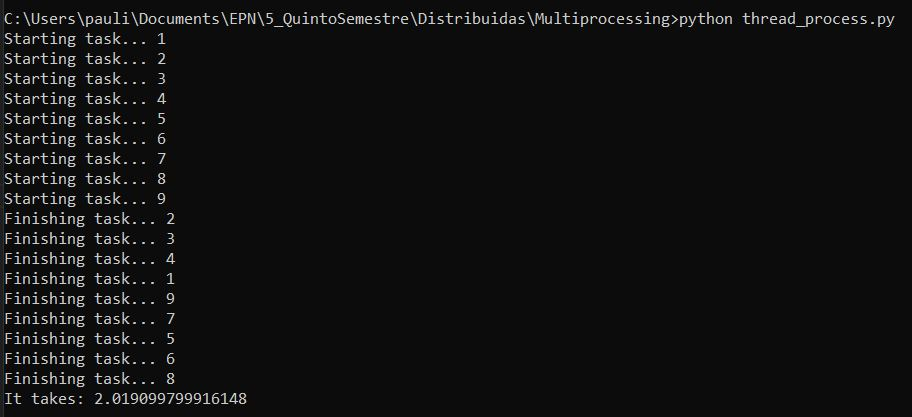

### Hilos de ejecución  
<hr>
Los hilos de ejecución representan el proceso de una  tarea dentro del procesador.

Cada hilo de ejecución realiza una determinada tarea, y un hilo puede ejecutarse simultaneamente con otros hilos.

Una vez que un hilo ha iniciado su proceso de ejecución, finaliza su proceso dependiendo del orden en que fueron llamados para realizar su tarea.   
<br>
<hr>  

### Explicación del código

Se importan las clases.  
<em>Time</em> para establecer un contador que determine el tiempo de ejecución y finalización de todos los hilos.  
<em>Thread</em> permite configurar un hilo independiente.
```py
from time import sleep, perf_counter
from threading import Thread
```
<br>
La función <em>task()</em> imprime el identificador del hilo de ejecución iniciado, y su finalización tras dos segundos de espera.

Se inicializa el contador.  
Se declara un array que almacenará cada hilo con su información.

```py
def task(id):
    print('Starting task... {}'.format(id))
    sleep(2)
    print('Finishing task... {}'.format(id))
    id*id*id*id

start_time = perf_counter()
threads = []
```
Se generan un total de 10 hilos de ejecución mediante el método <em>Thread</em>, que recibe como parámetro <em>target</em> la función a ser ejecutada, y como <em>n</em> el número de la tupla de la función enviada.  
Se añade cada objeto al array creado.  
Se inicia la ejecución de cada hilo mediante el método <em>start()</em>.

El método <em>join()</em> espera a que cada hilo en ejecución termine su proceso.

```py
for n in range(1,10):
    t = Thread(target=task, args=(n,))
    threads.append(t)
    t.start()

for t in threads:
    t.join()
```

Se detiene el contador y se imprime el tiempo total de ejecución de todos los hilos inicializados.
```py
end_time = perf_counter()
print('It takes: {}'.format(end_time - start_time))
```

A continuación, se presenta una captura con la ejecución del código:
